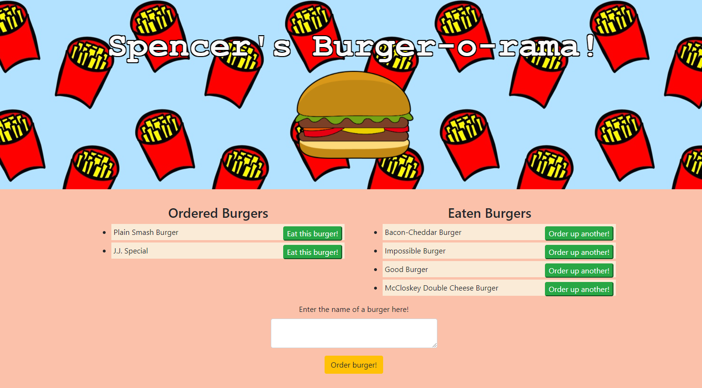

[](https://opensource.org/licenses/MIT)
# Eatin' Burgers App

## Description

This app is a simple site allowing a user to add burgers to a database and then change its value in  the database with the click of a button. This change is then reflected by moving the added list element to a separate column, signifying the burger had been "eaten". For this app, I used Express.js, mySQL, and Handlebars.js to build the application locally and then deployed it to Heroku with the JawsDB add-on.


---------------------------

The deployed and functional site on Heroku can be found here: <https://burger-o-rama.herokuapp.com/>

The full process can be found on [my Github](https://github.com/spencerv86/) repository linked here:
<https://github.com/spencerv86/burger-o-rama>


---------------------------

## Table of Contents

* [Installation](#installation)
* [Usage](#usage)
* [Credits](#credits)
* [License](#license)


## Installation

If you would like to inspect the code, please begin by forking the repository and downloading to your computer. Make sure that you have node already installed. 
You may need to run 
```npm init``` or ```npm install``` but no other files should be necessary. You will need to create the database ```burgers_db``` in mySQL Workbench and insert your own password in the connection.js to use locally. Run ```npm start``` to create the server on a localhost.

If you would simply like to see the app in action, no installation is needed, just click the following link: <https://burger-o-rama.herokuapp.com/>

## Usage

To use the application, simply type in the name of a burger you would like to order and click 'Order burger'. This will add your burger to the Ordered Burgers column. Clicking the 'Eat this burger' button will change the state of the burger and move it's item to the 'Eaten Burgers' column. Clicking the 'Order up another!' button will reverse the change and move it back to the 'Ordered Burgers' column. There are multiple burgers already added to each column to ease demonstration but feel free to add more of your own!



## Credits

Thanks to the teaching staff and huge thanks to the fellow members of my cohort for assisting me in a killer debugging session. 

## License

MIT License

Copyright (c) 2021 Spencer Vaughan

Permission is hereby granted, free of charge, to any person obtaining a copy
of this software and associated documentation files (the "Software"), to deal
in the Software without restriction, including without limitation the rights
to use, copy, modify, merge, publish, distribute, sublicense, and/or sell
copies of the Software, and to permit persons to whom the Software is
furnished to do so, subject to the following conditions:

The above copyright notice and this permission notice shall be included in all
copies or substantial portions of the Software.

THE SOFTWARE IS PROVIDED "AS IS", WITHOUT WARRANTY OF ANY KIND, EXPRESS OR
IMPLIED, INCLUDING BUT NOT LIMITED TO THE WARRANTIES OF MERCHANTABILITY,
FITNESS FOR A PARTICULAR PURPOSE AND NONINFRINGEMENT. IN NO EVENT SHALL THE
AUTHORS OR COPYRIGHT HOLDERS BE LIABLE FOR ANY CLAIM, DAMAGES OR OTHER
LIABILITY, WHETHER IN AN ACTION OF CONTRACT, TORT OR OTHERWISE, ARISING FROM,
OUT OF OR IN CONNECTION WITH THE SOFTWARE OR THE USE OR OTHER DEALINGS IN THE
SOFTWARE.